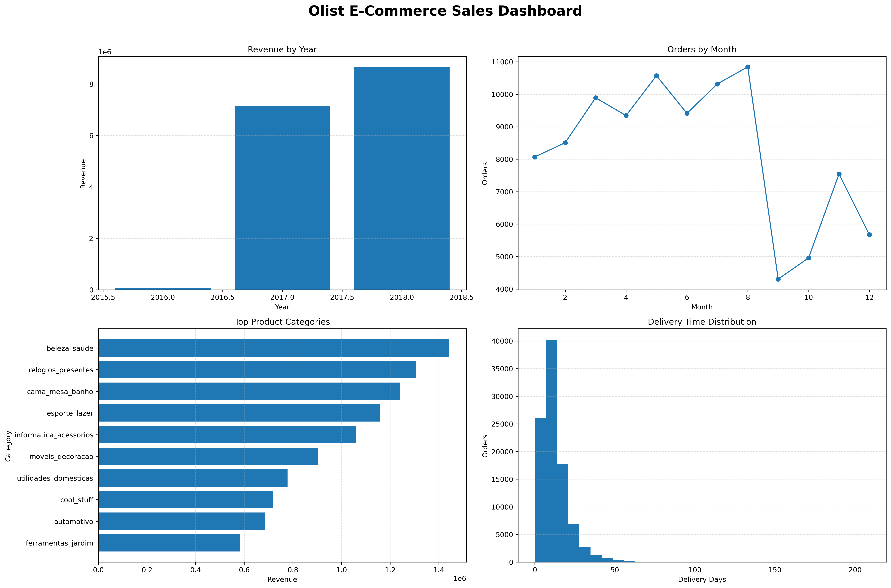
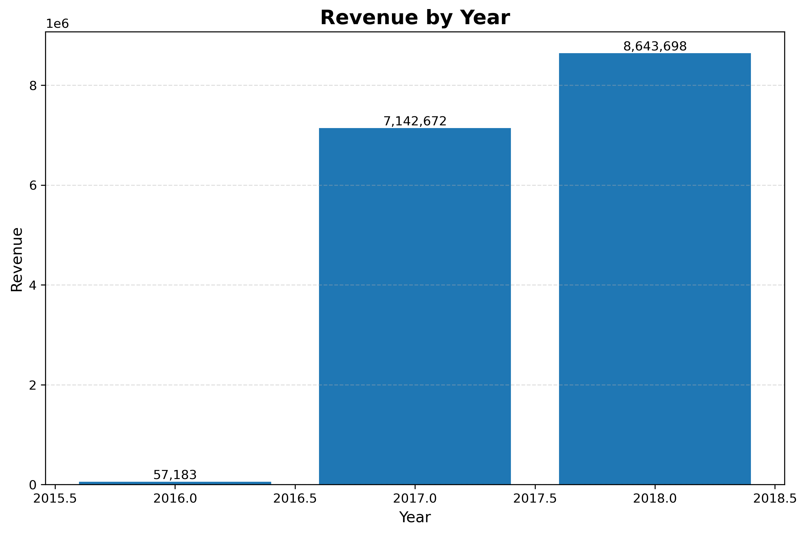
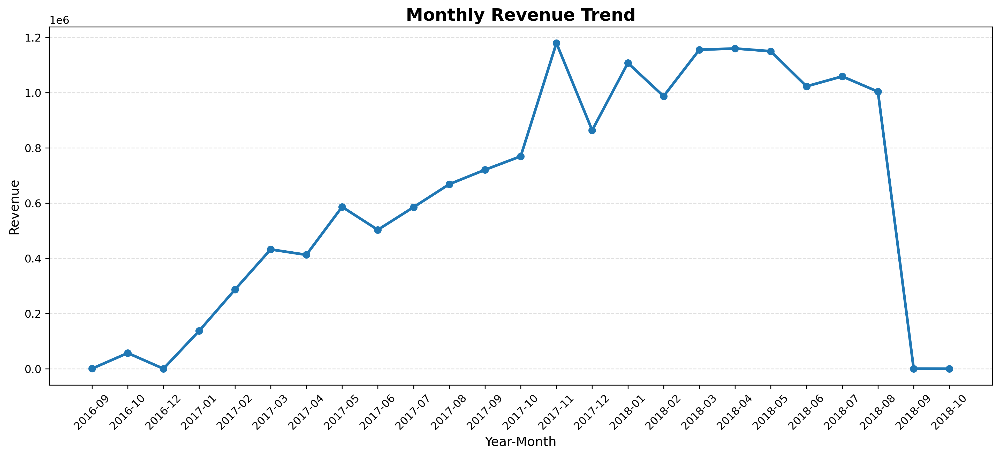
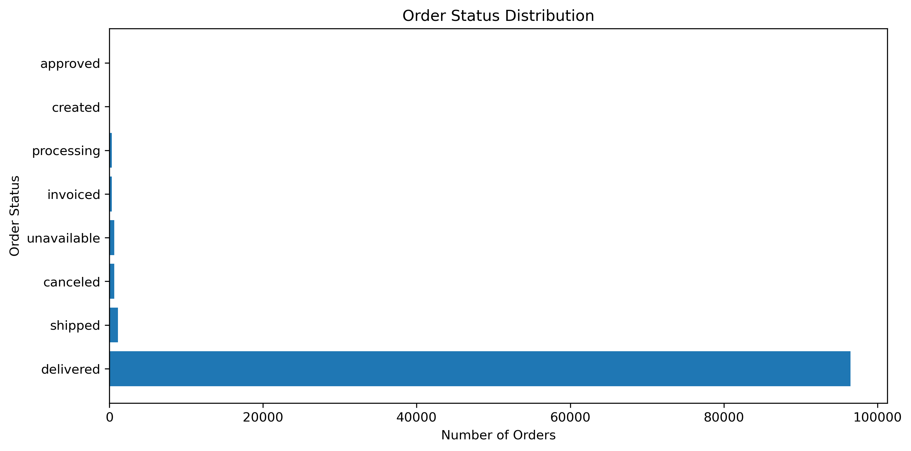
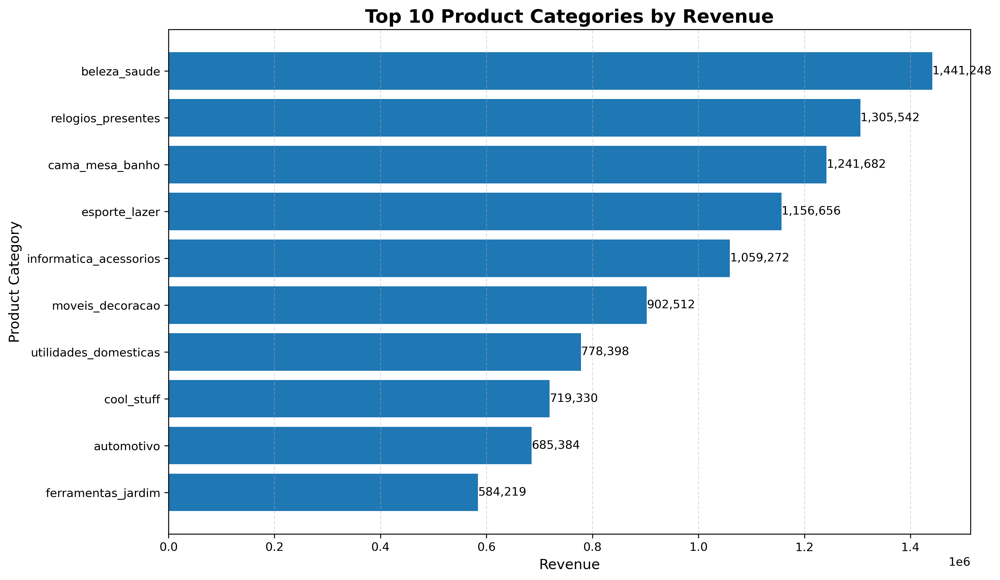

# 🛒 Olist E-commerce Sales Analysis using Python

## 📊 Dashboard



---

# 📌 Project Overview

This project analyzes the Brazilian Olist E-commerce dataset using Python. The objective is to explore sales performance, customer purchasing behavior, product category revenue, delivery efficiency, and overall business trends.

The project demonstrates an end-to-end data analytics workflow including data exploration, cleaning, transformation, visualization, and dashboard creation.

---

# 🎯 Objectives

- Explore the Olist E-commerce dataset
- Clean and prepare the data for analysis
- Merge multiple datasets using common keys
- Perform exploratory data analysis (EDA)
- Calculate business KPIs
- Visualize business trends
- Build an analytical dashboard using Matplotlib

---

# 🛠️ Technologies Used

- Python
- Pandas
- Matplotlib

---

# 📂 Project Structure

```
olist-ecommerce-sales-analysis-python/
│
├── data/
├── images/
├── scripts/
├── README.md
├── requirements.txt
└── LICENSE
```

---

# 📈 Analysis Performed

The project includes the following analyses:

- Data Exploration
- Revenue Analysis
- Monthly Revenue Analysis
- Orders by Month
- Order Status Distribution
- Top Product Categories by Revenue
- Delivery Performance
- Monthly Revenue Trend
- Customer Spending Analysis
- Delivery Delay Analysis
- Multi-Chart Dashboard

---

# 📊 Visualizations

## Revenue by Year



---

## Monthly Revenue Trend



---

## Order Status Distribution



---

## Top Product Categories



---

# 💡 Key Business Insights

- Revenue increased significantly from 2016 to 2018.
- A small number of product categories generated a large share of total revenue.
- Most orders were successfully delivered.
- Monthly sales showed clear seasonal trends.
- Most deliveries were completed within the expected timeframe.

---

# ▶️ How to Run

1. Clone this repository.

```
git clone https://github.com/rajendraprasad-gurram/olist-ecommerce-sales-analysis-python.git
```

2. Install dependencies.

```
pip install -r requirements.txt
```

3. Download the Olist dataset and place the CSV files inside the `data` folder.

4. Run any script from the `scripts` folder.

---

# 📁 Dataset

Dataset used:

**Brazilian Olist E-commerce Public Dataset**

https://www.kaggle.com/datasets/olistbr/brazilian-ecommerce

---

# 👨‍💻 Author

**Rajendra Prasad Gurram**

GitHub:
https://github.com/rajendraprasad-gurram

---

⭐ If you found this project useful, consider starring the repository.
